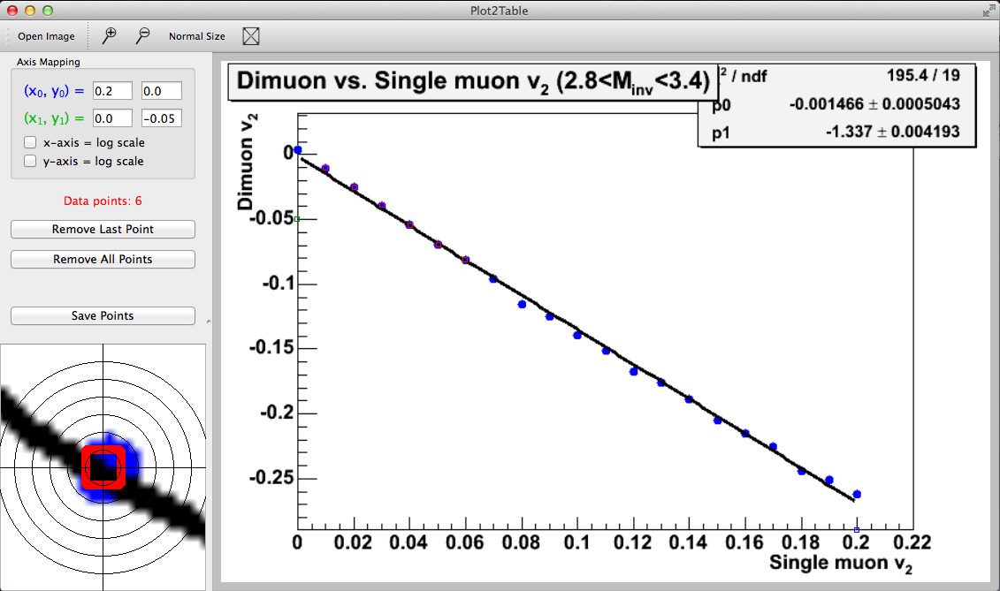

Plot2Table was designed to allow a user with a graphical plot to create a table of numerical values instead.  It works by clicking two points (one on each axis) and defining what the x,y values are at those points, then clicking on all the data points that are to be saved.  The program then uses the defined pixel->x,y mapping to create a table.  The numerical precision is of course limited by the pixel size and image quality.  There is currently preliminary support for error bars, but that is still WIP.  Log scales are supported.  Here is a screenshot of it running on my Mac:

This project is still in an unfinished state.  It has been built using Qt 5.2 on Mac OSX 10.9.5.  All other configurations are at your own risk (it was running on Scientific Linux several versions ago).

To build, just use "qmake" and "make".  The configuration itself is stored in plot2table.pro.  My "To Do" list is in notes.rtf, sorry if you can't read Mac rich-text files.

Binaries for Windows, Mac, and Linux are written to plot2table.exe, plot2table.app, and plot2table, respectively.

I've included a simple plot for tests, dimu_v2.gif.  When launching plot2table, you can give an image as a command-line argument, and it will be automatically placed in the Open dialog.

Error bar input is still undocumented (since I haven't settled on a scheme).  There are a whole boatload of things I haven't implemented yet.  You might want to remove the DEBUG define from plot2table.pro, otherwise the output file is always "points.dat", and there is a lot of stuff printed to the terminal.  Like I said, unfinished or not production.

Please don't use this for a published plot; I'm not responsible for you being stoned, tarred and feathered at a conference, or worse, denied tenure.

-Matt Wysocki, Nov 19 2014
